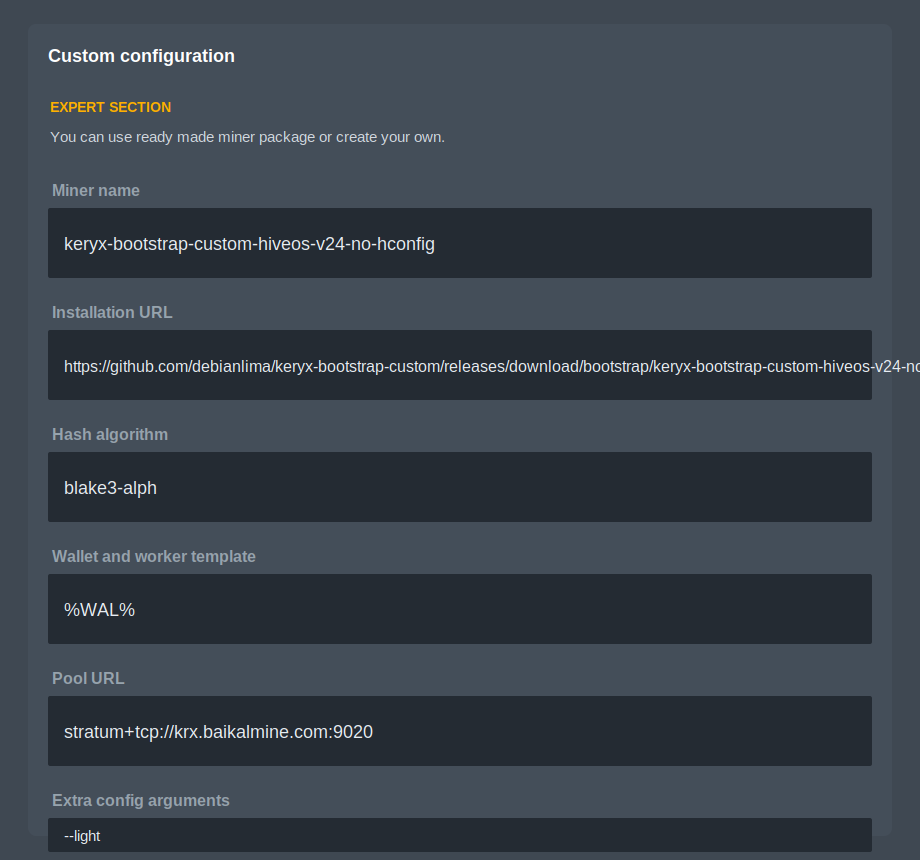

# keryx-bootstrap-custom

Bootstrap para rodar o Keryx Miner no HiveOS como Custom Miner.

## Status atual

Versao atual: v1.0-external-inference.

Mudancas principais:

- Mantem a base do bootstrap v24-no-hconfig-defaults.
- O h-config.sh nao usa mais pool, wallet nem extra args padrao.
- O comando do minerador vem somente do Flight Sheet/API do HiveOS.
- CUSTOM_URL vira -s.
- CUSTOM_TEMPLATE vira --mining-address.
- CUSTOM_USER_CONFIG vira argumentos extras.
- Se Extra config estiver vazio, o script nao adiciona --light automaticamente.
- Para usar light, coloque --light no Extra config arguments.
- Mantem o modo Docker para kernel inferior a 6.6 e o aviso ao usuario.
- Mantem h-stats no padrao HiveOS com hs_units khs.
- Adiciona suporte experimental a backend externo de inferencia compativel com OpenAI.
- Permite declarar capacidade virtual para modelos maiores, como deepseek-r1-32b, quando uma API externa/local estiver respondendo.

## Minerador v1.0: backend externo de inferencia

A versao 1.0 adiciona um modo opcional para o Keryx consultar uma API local ou remota compativel com OpenAI quando precisar responder uma inferencia OPoI.

O funcionamento padrao continua igual. Se nenhuma flag `--external-inference-*` for usada, o Keryx usa o fluxo original com os modelos locais, Candle/CUDA e os arquivos `.ok` em `models/`.

Com backend externo habilitado, o desenho fica assim:

```text
Keryx Miner no HiveOS
  -> PoW e fluxo padrao continuam no rig
  -> inferencia de modelo externo vai para uma API OpenAI-compatible
        -> llama.cpp / vLLM / outro servidor local
        -> modelo maior, por exemplo 32B, pode rodar em outra GPU ou em varias GPUs
```

Importante: este modo nao cria uma GPU falsa no Linux e nao mascara VRAM no driver NVIDIA. A capacidade virtual e declarada pelo Keryx somente quando o backend externo configurado responde ao teste inicial.

### Exemplo com backend externo 32B

Exemplo de uso direto no terminal:

```bash
./keryx-miner \
  -s stratum+tcp://krx.baikalmine.com:9020 \
  --mining-address keryx:SEU_ENDERECO \
  --external-inference-url http://127.0.0.1:8000/v1/chat/completions \
  --external-inference-model deepseek-r1-32b=DeepSeek-R1-32B-GGUF \
  --external-inference-timeout-sec 240
```

Exemplo com chave de API:

```bash
./keryx-miner \
  -s stratum+tcp://krx.baikalmine.com:9020 \
  --mining-address keryx:SEU_ENDERECO \
  --external-inference-url http://192.168.1.50:8000/v1/chat/completions \
  --external-inference-model deepseek-r1-32b=DeepSeek-R1-32B-GGUF \
  --external-inference-api-key SUA_CHAVE_AQUI \
  --external-inference-timeout-sec 240
```

Exemplo no campo `Extra config arguments` do HiveOS:

```text
--external-inference-url http://127.0.0.1:8000/v1/chat/completions --external-inference-model deepseek-r1-32b=DeepSeek-R1-32B-GGUF --external-inference-timeout-sec 240
```

Com API protegida por chave:

```text
--external-inference-url http://192.168.1.50:8000/v1/chat/completions --external-inference-model deepseek-r1-32b=DeepSeek-R1-32B-GGUF --external-inference-api-key SUA_CHAVE_AQUI --external-inference-timeout-sec 240
```

### Explicacao das flags externas

#### `--external-inference-url`

Define o endpoint HTTP que o Keryx vai chamar para gerar a resposta da inferencia.

Deve apontar para um endpoint compativel com OpenAI Chat Completions, normalmente:

```text
http://IP_DO_SERVIDOR:PORTA/v1/chat/completions
```

Exemplos:

```text
http://127.0.0.1:8000/v1/chat/completions
http://192.168.1.50:8000/v1/chat/completions
```

Use `127.0.0.1` quando o backend de IA estiver na mesma maquina do minerador. Use o IP da rede local quando o backend estiver em outro computador.

#### `--external-inference-model`

Declara quais modelos do Keryx serao atendidos pelo backend externo.

Formato simples, quando o nome do modelo no backend externo e igual ao nome interno do Keryx:

```text
--external-inference-model deepseek-r1-32b
```

Formato com mapeamento, quando o nome do modelo na API externa e diferente:

```text
--external-inference-model deepseek-r1-32b=DeepSeek-R1-32B-GGUF
```

Neste exemplo:

```text
deepseek-r1-32b       = nome interno/model_id conhecido pelo Keryx
DeepSeek-R1-32B-GGUF  = nome do modelo publicado pela API externa
```

A flag pode ser repetida para mais de um modelo:

```text
--external-inference-model tinyllama=TinyLlama-1.1B-GGUF --external-inference-model deepseek-r1-32b=DeepSeek-R1-32B-GGUF
```

O Keryx so deve declarar a capacidade externa depois que o probe da API passar.

#### `--external-inference-api-key`

Define uma chave opcional para APIs externas protegidas.

Quando usada, o Keryx envia a chave no cabecalho HTTP como token Bearer:

```text
Authorization: Bearer SUA_CHAVE_AQUI
```

Use somente se o backend externo exigir autenticacao. Se a API estiver aberta apenas em `127.0.0.1` e nao exigir chave, essa flag pode ficar ausente.

#### `--external-inference-timeout-sec`

Define o tempo maximo, em segundos, que o Keryx aguarda cada resposta da API externa.

Valor padrao do minerador v1.0:

```text
180
```

Para modelo grande, especialmente 32B em varias GPUs ou quantizacao pesada, recomenda-se usar um valor maior:

```text
--external-inference-timeout-sec 240
```

Se o backend externo demorar mais que esse tempo, a inferencia falha e o Keryx nao deve usar aquela resposta.

## Exemplo de backend externo com llama.cpp

Exemplo conceitual para rodar um servidor local compativel com OpenAI:

```bash
llama-server \
  -m /modelos/deepseek-r1-32b.gguf \
  --host 127.0.0.1 \
  --port 8000 \
  --n-gpu-layers 999 \
  --split-mode layer \
  --tensor-split 1,1,1
```

Depois configure o Keryx com:

```text
--external-inference-url http://127.0.0.1:8000/v1/chat/completions --external-inference-model deepseek-r1-32b=DeepSeek-R1-32B-GGUF --external-inference-timeout-sec 240
```

## Versao do minerador original

O bootstrap nao baixa automaticamente a ultima release do Keryx-Labs/keryx-miner.

Por padrao, ele baixa sempre a versao fixada no keryx-bootstrap.sh:

```text
KERYX_REPO=Keryx-Labs/keryx-miner
KERYX_TAG=v0.3.2-OPoI
```

Isso foi feito de proposito para evitar que uma release nova do minerador original quebre o Custom Miner do HiveOS sem teste.

Para usar um pacote customizado, force uma URL exata do pacote:

```bash
export KERYX_PACKAGE_URL="https://github.com/debianlima/keryx-bootstrap-custom/releases/download/v1.0/keryx-miner-0.3.2-OPoI-external-backend-devwallet-sm86-linux-amd64.tar.gz"
```

Ou, no proprio bootstrap/release, atualize `KERYX_PACKAGE_URL` para apontar para o asset customizado.

## Destaque: modo de compatibilidade HiveOS kernel 6.1.0

Este pacote tem modo de compatibilidade para rigs HiveOS antigas, principalmente rigs com kernel 6.1.0-hiveos.

Quando o kernel for inferior a 6.6, o h-run.sh muda automaticamente para execucao em container Ubuntu 22.04. Isso evita erro de biblioteca/GLIBC em imagens antigas do HiveOS sem obrigar troca imediata da imagem do sistema.

O que acontece automaticamente no modo compatibilidade:

- envia aviso ao usuario recomendando atualizar o HiveOS/kernel;
- informa que o Keryx vai rodar em container Ubuntu 22.04;
- tenta instalar wget e ca-certificates no host;
- tenta instalar e iniciar Docker se necessario;
- cria a imagem local keryx-hiveos-ubuntu22:22.04;
- monta /hive/miners/custom dentro do container como /miners;
- mantem a execucao dentro da screen padrao do HiveOS;
- mantem o log em /var/log/miner/keryx-miner.log;
- mantem o h-stats.sh alimentando a API de monitoramento do HiveOS.

Resumo:

```text
Kernel 6.6 ou superior  -> roda nativo no HiveOS
Kernel inferior a 6.6   -> roda em container Ubuntu 22.04
Kernel 6.1.0-hiveos    -> modo compatibilidade ativado automaticamente
```

Dependencias instaladas no host quando necessario:

```bash
apt-get update
apt-get install -y wget ca-certificates
```

Observacao: o modo Docker precisa que o Docker consiga acessar as GPUs com --gpus all. Se o runtime NVIDIA do Docker nao estiver disponivel, o erro aparece no log e o loop do minerador continua tentando.

## Release

URL direta esperada do asset v1.0:

```text
https://github.com/debianlima/keryx-bootstrap-custom/releases/download/v1.0/keryx-bootstrap-custom-hiveos-v1.0-external-inference.tar.gz
```

Asset do minerador customizado esperado:

```text
https://github.com/debianlima/keryx-bootstrap-custom/releases/download/v1.0/keryx-miner-0.3.2-OPoI-external-backend-devwallet-sm86-linux-amd64.tar.gz
```

## Flight Sheet

### Modo padrao light

```text
Miner: Custom
Miner name: keryx-bootstrap-custom-hiveos-v1.0
Installation URL: https://github.com/debianlima/keryx-bootstrap-custom/releases/download/v1.0/keryx-bootstrap-custom-hiveos-v1.0-external-inference.tar.gz
Hash algorithm: blake3-alph
Pool URL: stratum+tcp://krx.baikalmine.com:9020
Pass: vazio
Extra config arguments: --light
```

### Modo com backend externo 32B

```text
Miner: Custom
Miner name: keryx-bootstrap-custom-hiveos-v1.0
Installation URL: https://github.com/debianlima/keryx-bootstrap-custom/releases/download/v1.0/keryx-bootstrap-custom-hiveos-v1.0-external-inference.tar.gz
Hash algorithm: blake3-alph
Pool URL: stratum+tcp://krx.baikalmine.com:9020
Pass: vazio
Extra config arguments: --external-inference-url http://127.0.0.1:8000/v1/chat/completions --external-inference-model deepseek-r1-32b=DeepSeek-R1-32B-GGUF --external-inference-timeout-sec 240
```

Coloque sua wallet no campo Wallet and worker template.

### Exemplo visual no HiveOS



## Instalacao manual de recuperacao

Use este comando quando o minerador nao iniciar, quando o HiveOS nao criar a pasta `/hive/miners/custom`, ou quando a pasta `custom` tiver sido apagada:

```bash
miner stop 2>/dev/null || true
sleep 3
screen -wipe || true

URL="https://github.com/debianlima/keryx-bootstrap-custom/releases/download/v1.0/keryx-bootstrap-custom-hiveos-v1.0-external-inference.tar.gz"
TMP="/tmp/keryx-custom-manual"
PKG="/tmp/keryx-custom.tar.gz"

rm -rf "$TMP"
mkdir -p "$TMP" /hive/miners/custom

wget -O "$PKG" "$URL" || exit 1
gzip -t "$PKG" || exit 1
tar -xzf "$PKG" -C "$TMP" || exit 1

if [ -f "$TMP/h-manifest.conf" ]; then
  cp -af "$TMP/." /hive/miners/custom/
elif [ -f "$TMP/custom/h-manifest.conf" ]; then
  cp -af "$TMP/custom/." /hive/miners/custom/
else
  echo "ERRO: pacote baixado, mas h-manifest.conf nao foi encontrado"
  find "$TMP" -maxdepth 3 -type f | sort
  exit 1
fi

chmod 755 /hive/miners/custom/h-run \
          /hive/miners/custom/h-run.sh \
          /hive/miners/custom/h-config.sh \
          /hive/miners/custom/h-stats.sh \
          /hive/miners/custom/keryx-bootstrap.sh \
          /hive/miners/custom/keryx-miner 2>/dev/null || true

[ -f /hive/miners/custom/keryx-miner.bin ] && chmod 755 /hive/miners/custom/keryx-miner.bin

ls -la /hive/miners/custom
miner start
```

## Hotfix rapido

```bash
miner stop 2>/dev/null || true
sleep 3
screen -wipe || true
wget -qO /hive/miners/custom/h-config.sh https://raw.githubusercontent.com/debianlima/keryx-bootstrap-custom/keryx-api-local/h-config.sh
chmod 755 /hive/miners/custom/h-config.sh
miner start
```

## Conferencia

```bash
cat /hive/miners/custom/config.ini
/hive/miners/custom/h-stats.sh
/hive/miners/custom/keryx-miner.bin --help | grep external-inference
```
